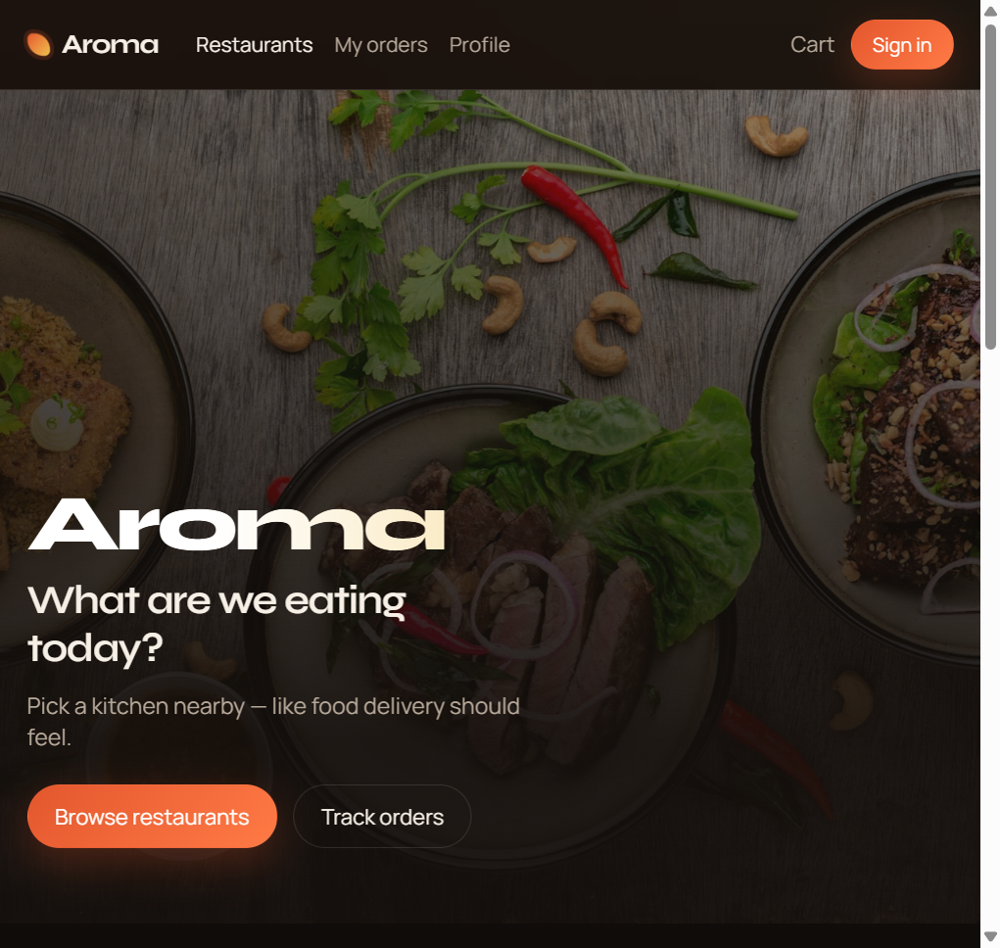
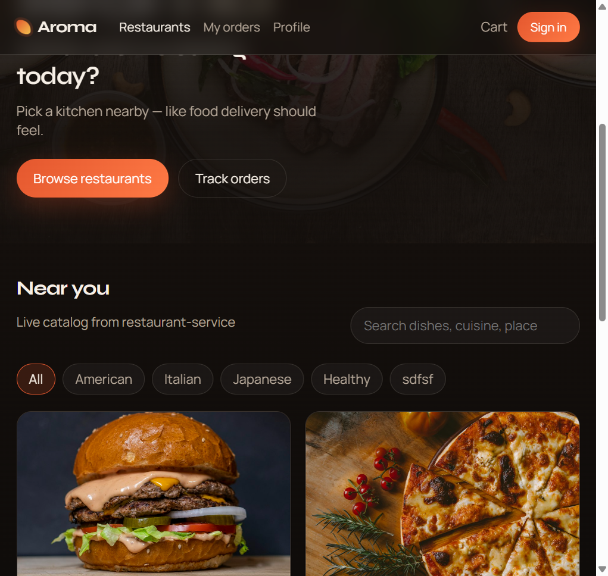
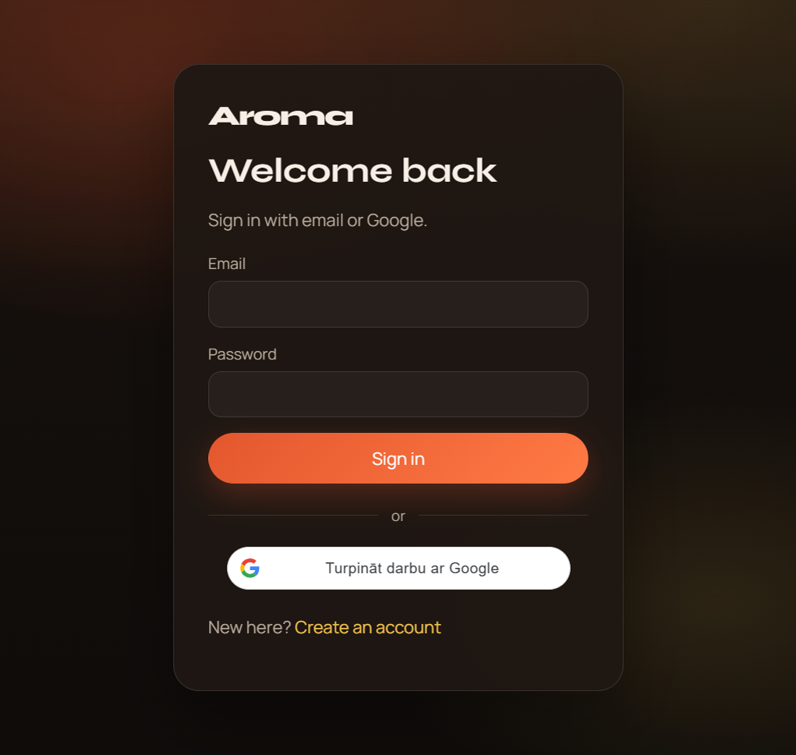
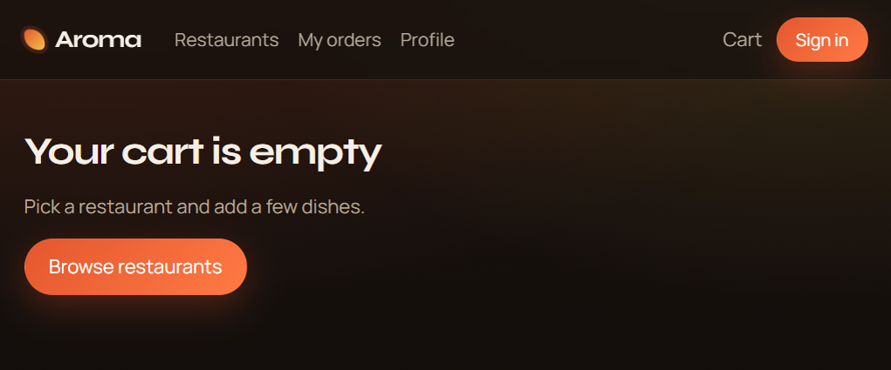
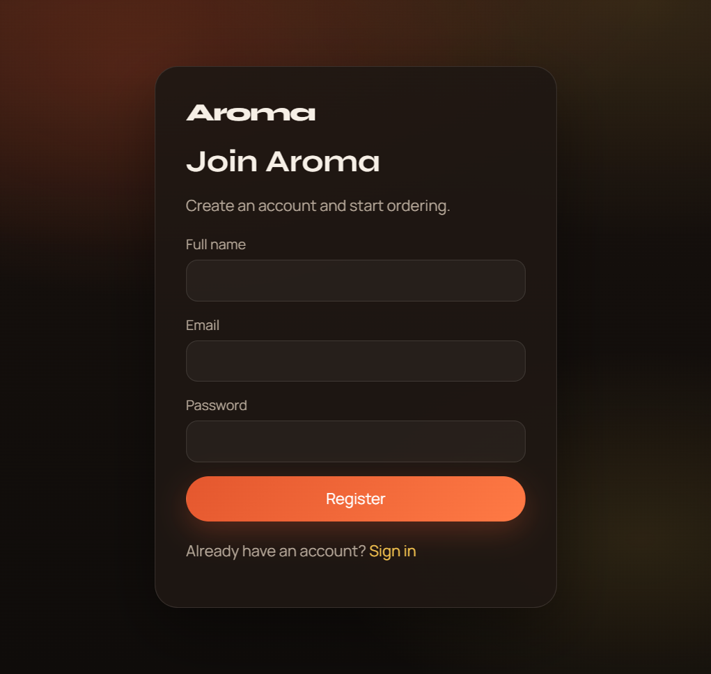
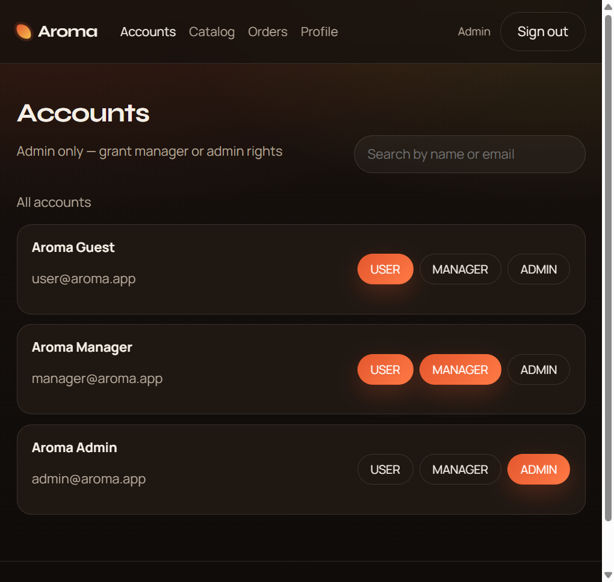

# Aroma Food — React Frontend

Customer, manager, and admin UI for the **Aroma Food** delivery platform.

Backend: [`food`](https://github.com/top-secret666/food) (`user-service`, `restaurant-service`, `order-service`)

### Live demo

| Host | URL |
|------|-----|
| **Production (Vercel)** | **https://aroma-food.vercel.app** |
| Alt alias | https://aromafood.vercel.app |
| Legacy alias | https://reactfistapp.vercel.app |
| GitHub Pages | https://top-secret666.github.io/aroma-food/ |

<p align="center">
  
</p>

---

## Features

| Role | What you get |
|------|----------------|
| **Customer** | Restaurant catalog & filters, menus with images, Redux cart, checkout, order history + live status timeline |
| **Manager** | Delivery desk — view all orders, update kitchen / delivery status |
| **Admin** | Account roles (`USER` / `MANAGER` / `ADMIN`), restaurant & dish CRUD |

Also: email login, **Google Sign-In**, JWT + refresh via Axios interceptors, protected / role routes.

---

## Screenshots

| Home | Near you |
|:----:|:--------:|
|  |  |

| Restaurant menu | Sign in |
|:---------------:|:-------:|
|  |  |

| Empty cart | Register |
|:----------:|:--------:|
|  |  |

| Catalog admin | Accounts |
|:-------------:|:--------:|
|  |  |

| Delivery desk |
|:-------------:|
|  |

---

## Quick start

### 1. Backend (local, no Docker)

From the sibling `food` repo:

```powershell
.\start-local.ps1
```

### 2. Frontend

```bash
cp .env.example .env
npm install
npm start
```

App: **http://localhost:3000**

### Environment

| Variable | Default | Description |
|----------|---------|-------------|
| `REACT_APP_USER_API` | `http://localhost:8084` | user-service |
| `REACT_APP_RESTAURANT_API` | `http://localhost:8081` | restaurant-service |
| `REACT_APP_ORDER_API` | `http://localhost:8082` | order-service |
| `REACT_APP_GOOGLE_CLIENT_ID` | *(empty)* | Google OAuth **Web** Client ID |

---

## Demo accounts

Password for all: **`aroma123`**

| Email | Role | Lands on |
|-------|------|----------|
| `user@aroma.app` | Customer | Home / restaurants |
| `manager@aroma.app` | Manager | `/manager/orders` |
| `admin@aroma.app` | Admin | `/admin/restaurants` |

### Google Sign-In

1. Create an OAuth 2.0 **Web application** client in Google Cloud Console  
2. Authorized JavaScript origins: `http://localhost:3000`  
3. Put the Client ID in `.env` as `REACT_APP_GOOGLE_CLIENT_ID`  
4. Use the **same** value as `GOOGLE_CLIENT_ID` for `user-service`  
5. Restart `npm start` (CRA reads env at boot)

---

## Project structure

```text
react_fistapp/   (local folder; GitHub repo: aroma-food)
├── docs/screenshots/     README images
├── public/
├── src/
│   ├── api/              Axios clients + interceptors
│   ├── components/       Layout, Navbar, route guards
│   ├── hooks/            Auth bootstrap
│   ├── pages/            Home, menu, cart, checkout, orders, admin…
│   ├── store/            Redux Toolkit (auth + cart)
│   └── utils/            Roles, formatting
├── .env.example
├── Dockerfile
├── vercel.json
└── README.md
```

---

## Scripts

| Command | Description |
|---------|-------------|
| `npm start` | Dev server on `:3000` |
| `npm run build` | Production bundle → `build/` |
| `npm test` | CRA test runner |

---

## Deploy

### Vercel

1. Import this repo  
2. Set `REACT_APP_USER_API`, `REACT_APP_RESTAURANT_API`, `REACT_APP_ORDER_API` to public API URLs  
3. Optionally set `REACT_APP_GOOGLE_CLIENT_ID` and add the Vercel origin in Google Cloud  
4. Ensure backend `CORS_ALLOWED_ORIGINS` includes your Vercel domain  

`vercel.json` already rewrites SPA routes to `index.html`.

### Docker

```bash
docker build \
  --build-arg REACT_APP_USER_API=https://your-user-api \
  --build-arg REACT_APP_RESTAURANT_API=https://your-restaurant-api \
  --build-arg REACT_APP_ORDER_API=https://your-order-api \
  -t aroma-frontend .

docker run --rm -p 3000:80 aroma-frontend
```

---

## Stack

- React 19 + Create React App  
- Redux Toolkit + react-redux  
- react-router-dom  
- Axios (Bearer + refresh interceptors)  
- Google Identity Services  

---

## Author

Dana Stukalova
